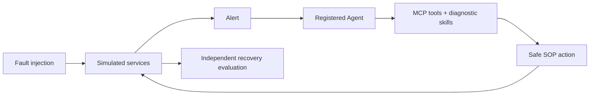

# AI Incident Lab

[简体中文](README.zh-CN.md) · [Architecture](ARCHITECTURE.md) · [Contributing](CONTRIBUTING.md) · [Security](SECURITY.md)

An observable playground for testing how AI agents diagnose and recover from incidents through MCP.

Inject a fault, watch its impact spread through the service topology, and follow an agent from alert reception to evidence collection, diagnosis, SOP execution, and verified recovery. Compare agents using recorded outcomes and replay each experiment.



## Quick start

Requires Docker with Docker Compose:

```sh
cp .env.example .env
docker compose up --build
```

Open **http://localhost:5173**, choose the Reference Agent, and inject a fault. No API key is needed. API documentation is available at **http://localhost:8000/docs**.

The Reference Agent is a deterministic baseline. To use an LLM, configure `LLM_API_KEY`, `LLM_BASE_URL`, and `LLM_MODEL` in your local `.env`, restart the services, and select an LLM Agent. The provider must support Chat Completions function tools.

## What you can explore

- **Environment:** ten simulated services and twelve dependencies, with node health, causal fault propagation, and fault markers visible to the operator.
- **Agent execution:** MCP calls, structured evidence, diagnosis, action decisions, recovery verification, and downloadable reports.
- **Timeline and replay:** metrics annotated with injection, alert, agent intervention, repair, and recovery events.
- **Comparison:** agent rankings based on measured recovery, diagnosis, safety, and scenario coverage.

| Fault | Injection target |
| --- | --- |
| Connection leak | Worker |
| CPU saturation | API |
| Slow queries | Database |
| Consumer backlog | Worker |
| Service outage | Queue |
| Shared connection pool exhaustion | Database proxy |

Services are stateful simulations, not real Redis/database workloads. This is a local experimentation platform; the control API is not authenticated for production use. Compose binds published ports to localhost.

## Connect your agent

1. Register an external agent in the UI and save its one-time token locally.
2. Configure MCP at `http://localhost:5173/mcp` using `Authorization: Bearer <token>`.
3. Call `check_connection`, then poll `receive_alert` for assignments.
4. Use MCP observations, diagnostic skills, and SOP tools to diagnose, repair, and verify the incident.

For a working reference client, set `INCIDENTLAB_AGENT_TOKEN` in your ignored `.env` and run:

```sh
uv run python -m apps.agent.direct --url http://localhost:5173/mcp --once
```

See the [MCP integration guide](docs/guides/mcp-agents.md) for the tool contract and agent instructions. Tokens are scoped to registered agents; mutations and reports require the assigned `run_id`. Ground truth is kept outside agent observations.

## Develop and verify

Requires Python 3.12+, uv, and Node.js 22.12+:

```sh
make install
make dev
```

```sh
make test
make lint
cd apps/frontend
npx playwright install chromium
npm run test:e2e
```

CI runs Python tests, static checks, frontend builds, browser tests, Compose smoke checks, and a full-history secret scan. Browser traces are disabled because registration responses contain credentials. Local databases, logs, screenshots, and environment files are excluded from Git.

## Project layout

| Directory | Responsibility |
| --- | --- |
| `apps/control_api/` | Control API, agent registry, orchestration |
| `apps/agent/` | Isolated reference and LLM agents, direct MCP client |
| `apps/frontend/` | Environment, execution timeline, replay, leaderboard |
| `lab_mcp/` | MCP observation and action interface |
| `simulator/` | Causal environment and fault simulation |
| `evaluator/` | Independent outcome evaluation |
| `packages/` | Shared contracts and utilities |
| `scripts/` | Development and verification entry points |
| `tests/` | Unit and integration tests |
| `docs/` | Design, extension guides, verification records |

[Chinese usage and API reference](README.zh-CN.md) · [Environment extension guide](docs/architecture/extending-environments.md) · [Engineering specification](PROJECT_SPEC.md) · [Verification records](docs/verification.md)

A single active environment and one control worker keep experiments reproducible and implementation small. SQLite persists events and results; interrupted runs are marked failed when the control process restarts. LLM results depend on the selected provider and model. Action approval mode blocks automated actions; an approval UI is not implemented.

## Contributing

See [CONTRIBUTING.md](CONTRIBUTING.md) before opening a pull request. The documentation and contribution layout takes inspiration from [FastAPI](https://github.com/fastapi/fastapi) and [Chaos Mesh](https://github.com/chaos-mesh/chaos-mesh).

Licensed under [MIT](LICENSE).
